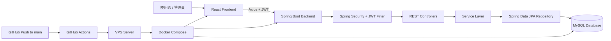
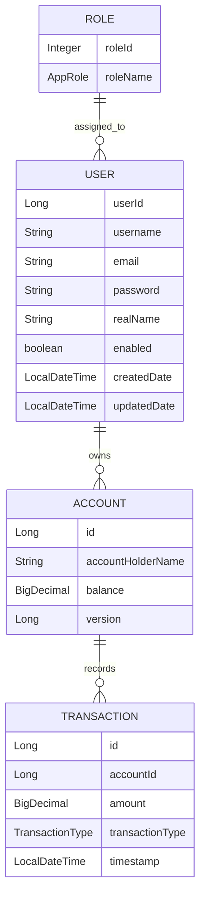

# Banking App 銀行帳戶管理系統

一個以 **Spring Boot + React** 開發的全端銀行帳戶管理系統，支援使用者註冊登入、JWT 身分驗證、角色權限控管、帳戶查詢、存款、提款、轉帳、交易紀錄查詢、管理員後台與 Docker 化部署。

此專案主要用於展示後端工程能力，包含 RESTful API 設計、Spring Security 權限控管、JPA 關聯建模、交易一致性處理、分頁查詢、例外處理、Swagger API 文件，以及 GitHub Actions 自動部署到 VPS。

---

## 專案亮點

- 使用 **Spring Boot 3 + Java 17** 建立 RESTful API
- 使用 **Spring Security + JWT** 實作無狀態登入驗證
- 支援 **ROLE_USER / ROLE_ADMIN** 角色權限控管
- 一般使用者只能操作自己的帳戶，管理員可管理所有帳戶
- 金額欄位使用 **BigDecimal**，避免浮點數精度問題
- 存款 / 提款使用 `@Version` 樂觀鎖與重試機制處理併發
- 轉帳流程使用 `@Transactional`，確保扣款與入帳具備一致性
- 轉帳時依照帳戶 ID 順序加鎖，降低死鎖風險
- 使用 Spring Data JPA + MySQL 進行資料持久化
- 使用 DTO / Mapper 分離 Entity 與 API 回傳資料
- 使用 Bean Validation 驗證請求資料
- 使用 Global Exception Handler 統一處理 API 錯誤回應
- 整合 Swagger / OpenAPI 文件
- 前端使用 React + Vite + Tailwind CSS
- 使用 Axios Interceptor 自動附加 JWT Token
- 使用 Docker Compose 一鍵啟動前端、後端、MySQL
- 使用 GitHub Actions 透過 SSH 自動部署到 VPS

---

## 技術棧

### Backend

| 技術 | 用途 |
|---|---|
| Java 17 | 後端主要開發語言 |
| Spring Boot 3.5 | 後端框架 |
| Spring Web | RESTful API |
| Spring Security | 身分驗證與授權 |
| JWT / JJWT | Token-based Authentication |
| Spring Data JPA / Hibernate | ORM 與資料庫操作 |
| MySQL 8 | 正式環境資料庫 |
| H2 Database | 測試 / 開發輔助資料庫 |
| Bean Validation | Request DTO 驗證 |
| Lombok | 減少樣板程式碼 |
| Springdoc OpenAPI | Swagger API 文件 |
| JUnit / MockMvc | Controller 測試 |
| Docker | 容器化部署 |

### Frontend

| 技術 | 用途 |
|---|---|
| React | 前端 UI |
| Vite | 前端建置工具 |
| React Router | 前端路由 |
| Tailwind CSS | UI 樣式 |
| Axios | API 請求 |
| React Context | 全域登入狀態管理 |
| React Toastify | 操作提示訊息 |
| Nginx | 前端靜態檔案部署與 SPA fallback |

### DevOps / Deployment

| 技術 | 用途 |
|---|---|
| Docker Compose | 一鍵啟動多容器服務 |
| GitHub Actions | CI/CD 自動部署 |
| VPS | 遠端部署環境 |
| Nginx | 前端容器服務 |
| GitHub Secrets | 管理部署密碼與環境變數 |

---

## 系統架構



---

## Entity 關係設計



---

## 核心功能

### 使用者功能

- 註冊帳號
- 登入並取得 JWT Token
- 查看個人資料
- 查看自己名下的所有銀行帳戶
- 查詢單一帳戶資訊
- 進行帳戶轉帳
- 查看交易紀錄
- 分頁瀏覽交易明細

### 管理員功能

- 查看所有帳戶
- 建立使用者帳戶
- 查詢任意帳戶
- 對指定帳戶存款
- 對指定帳戶提款
- 刪除帳戶
- 查看指定帳戶交易紀錄
- 使用分頁與排序管理帳戶列表

---

## 權限設計

| 角色 | 權限 |
|---|---|
| ROLE_USER | 查看自己的帳戶、查詢自己的交易紀錄、從自己的帳戶轉帳 |
| ROLE_ADMIN | 建立帳戶、查詢所有帳戶、存款、提款、刪除帳戶、查看所有交易紀錄 |

### 權限控管重點

後端使用 `@PreAuthorize` 進行方法層級授權，例如：

```java
@PreAuthorize("hasRole('ADMIN') or @accountSecurityService.isOwner(authentication,#id)")
```

此設計可確保：

- 管理員可以查詢任意帳戶
- 一般使用者只能查詢自己的帳戶
- 轉帳時會檢查轉出帳戶是否屬於目前登入者
- 避免使用者透過修改 URL ID 存取他人帳戶

---

## API 端點總覽

### Authentication API

Base URL：

```text
/api/auth
```

| Method | Endpoint | 權限 | 說明 |
|---|---|---|---|
| POST | `/public/signup` | Public | 使用者註冊 |
| POST | `/public/signin` | Public | 使用者登入並取得 JWT |
| GET | `/user` | Authenticated | 取得目前登入使用者資訊 |
| GET | `/username` | Authenticated | 取得目前登入使用者名稱 |

---

### Account API

Base URL：

```text
/api/accounts
```

| Method | Endpoint | 權限 | 說明 |
|---|---|---|---|
| GET | `/my-accounts` | USER | 取得目前使用者名下帳戶 |
| POST | `/` | ADMIN | 建立新帳戶 |
| GET | `/{id}` | ADMIN 或帳戶本人 | 查詢單一帳戶 |
| PUT | `/{id}/deposit` | ADMIN | 存款 |
| PUT | `/{id}/withdraw` | ADMIN | 提款 |
| GET | `/` | ADMIN | 分頁查詢所有帳戶 |
| DELETE | `/{id}` | ADMIN | 刪除帳戶 |
| POST | `/transfer` | 轉出帳戶本人 | 轉帳 |
| GET | `/{id}/transactions` | ADMIN 或帳戶本人 | 分頁查詢交易紀錄 |

---

## 交易與併發處理設計

### 金額處理

本專案使用 `BigDecimal` 儲存與計算金額，避免 `double` / `float` 在金融情境中可能產生的精度問題。

---

### 存款 / 提款

存款與提款流程會：

1. 查詢帳戶是否存在
2. 驗證提款時餘額是否足夠
3. 更新帳戶餘額
4. 新增交易紀錄
5. 回傳更新後帳戶資訊

帳戶 Entity 使用 `@Version` 欄位支援樂觀鎖。當高併發更新同一帳戶導致版本衝突時，Service 會捕捉 `ObjectOptimisticLockingFailureException` 並進行重試。

---

### 轉帳

轉帳流程使用 `@Transactional` 包住整個操作，確保以下操作要嘛全部成功，要嘛全部回滾：

1. 驗證轉出帳戶與轉入帳戶不可相同
2. 查詢並鎖定兩個帳戶
3. 驗證轉出帳戶餘額是否足夠
4. 從轉出帳戶扣款
5. 對轉入帳戶加款
6. 儲存兩筆帳戶異動
7. 新增 `TRANSFER_OUT` 與 `TRANSFER_IN` 兩筆交易紀錄

轉帳時依照帳戶 ID 順序加鎖，降低多筆交易同時轉帳時產生死鎖的機率。

---

## 錯誤處理

後端使用 `@ControllerAdvice` 建立全域例外處理，統一處理 API 錯誤回應。

常見錯誤包含：

| 錯誤類型 | HTTP Status | 說明 |
|---|---:|---|
| `AccountNotFoundException` | 404 | 帳戶不存在 |
| `InsufficientAmountException` | 400 | 餘額不足 |
| `AccountException` | 400 | 不合法的帳戶操作 |
| `AuthenticationException` | 401 | 身分驗證失敗 |
| `MethodArgumentNotValidException` | 400 | Request Body 驗證失敗 |
| `Exception` | 500 | 未預期錯誤 |

錯誤回應格式範例：

```json
{
  "timestamp": "2026-01-01T12:00:00",
  "message": "Insufficient amount",
  "details": "uri=/api/accounts/1/withdraw",
  "errorCode": "INSUFFICIENT_AMOUNT"
}
```

---

## 前端頁面

| 路徑 | 權限 | 說明 |
|---|---|---|
| `/` | Public | 首頁 |
| `/login` | Public | 登入頁 |
| `/signup` | Public | 註冊頁 |
| `/dashboard` | Authenticated | 使用者帳戶儀表板 |
| `/accounts/:id/transactions` | Authenticated | 交易紀錄頁 |
| `/accounts/:id/transfer` | Authenticated | 轉帳頁 |
| `/admin` | ADMIN | 管理員後台 |
| `/admin/accounts/create` | ADMIN | 建立帳戶 |
| `/admin/accounts/:id/deposit` | ADMIN | 存款 |
| `/admin/accounts/:id/withdraw` | ADMIN | 提款 |

---

## 專案結構

```text
banking-app
├── bank-backend
│   ├── src/main/java/net/javaguides/banking
│   │   ├── config
│   │   │   └── OpenApiConfig.java
│   │   ├── controller
│   │   │   ├── AuthController.java
│   │   │   ├── AccountController.java
│   │   │   └── CsrfController.java
│   │   ├── dto
│   │   │   ├── AccountDto.java
│   │   │   ├── AmountRequestDto.java
│   │   │   ├── CreateAccountRequest.java
│   │   │   ├── PageResponseDTO.java
│   │   │   ├── TransactionDTO.java
│   │   │   ├── TransferFundDTO.java
│   │   │   └── UserDTO.java
│   │   ├── entity
│   │   │   ├── Account.java
│   │   │   ├── User.java
│   │   │   ├── Role.java
│   │   │   ├── Transaction.java
│   │   │   └── AppRole.java
│   │   ├── exception
│   │   │   └── GlobalExceptionHandler.java
│   │   ├── mapper
│   │   │   └── AccountMapper.java
│   │   ├── repository
│   │   ├── security
│   │   │   ├── jwt
│   │   │   ├── request
│   │   │   ├── response
│   │   │   └── services
│   │   └── service
│   ├── Dockerfile
│   └── pom.xml
│
├── bank-frontend
│   ├── src
│   │   ├── api
│   │   │   └── apiClient.js
│   │   ├── components
│   │   ├── services
│   │   ├── store
│   │   │   └── auth-context.jsx
│   │   ├── App.jsx
│   │   └── main.jsx
│   ├── Dockerfile
│   ├── nginx.conf
│   ├── tailwind.config.js
│   └── vite.config.js
│
├── docker-compose.yml
└── .github/workflows/deploy.yml
```

---

## 本機啟動方式

### 1. Clone 專案

```bash
git clone https://github.com/jensenapp/banking-app.git
cd banking-app
```

---

### 2. 建立 `.env`

請在專案根目錄建立 `.env`：

```env
DB_ROOT_PASSWORD=your_mysql_root_password
DB_PASSWORD=your_mysql_user_password
JWT_SECRET=your_base64_jwt_secret
```

> 注意：正式專案請勿將 `.env` 提交到 GitHub，應改用 `.env.example` 提供欄位範例。

---

### 3. 使用 Docker Compose 啟動

```bash
docker compose up -d --build
```

啟動後服務位置：

| Service | URL |
|---|---|
| Frontend | `http://localhost:8086` |
| Backend API | `http://localhost:8089/api` |
| Swagger UI | `http://localhost:8089/swagger-ui/index.html` |
| MySQL | `127.0.0.1:3308` |

---

### 4. 關閉服務

```bash
docker compose down
```

若需要連資料庫 volume 一起刪除：

```bash
docker compose down -v
```

---

## 後端單獨啟動

```bash
cd bank-backend
mvn spring-boot:run
```

---

## 前端單獨啟動

```bash
cd bank-frontend
npm install
npm run dev
```

開發環境 API Base URL：

```env
VITE_API_BASE_URL=http://localhost:8089/api
```

---

## Swagger API 文件

啟動後可透過以下網址查看 API 文件：

```text
http://localhost:8089/swagger-ui/index.html
```

Swagger 已整合 JWT Bearer Token 設定，可在登入取得 Token 後，透過 Authorize 按鈕測試需要驗證的 API。

---

## 測試

後端包含 Controller 測試，使用 MockMvc 驗證 API 行為，例如：

- 建立帳戶成功回傳 201
- 輸入資料不合法回傳 400
- 查詢不存在帳戶回傳 404
- 分頁查詢帳戶
- 查詢交易紀錄
- 提款成功
- 餘額不足時回傳錯誤

執行測試：

```bash
cd bank-backend
mvn test
```

---

## 部署流程

此專案已設定 GitHub Actions，當程式碼推送到 `main` 分支時，會自動透過 SSH 連線到 VPS 並執行部署流程。

部署流程包含：

1. 進入 VPS 上的專案部署目錄
2. 若尚未 clone 專案，則從 GitHub clone
3. 若已存在專案，則 pull 最新程式碼
4. 從 GitHub Secrets 產生 `.env`
5. 執行 Docker Compose 重建與啟動服務
6. 清理 dangling Docker images，避免 VPS 空間不足

GitHub Secrets 需設定：

| Secret Name | 說明 |
|---|---|
| `VPS_HOST` | VPS IP 或網域 |
| `VPS_USERNAME` | VPS 使用者名稱 |
| `VPS_SSH_KEY` | SSH Private Key |
| `DB_ROOT_PASSWORD` | MySQL root 密碼 |
| `DB_PASSWORD` | MySQL 使用者密碼 |
| `JWT_SECRET` | JWT 簽章密鑰 |

---


```text
Backend / Java / Spring Boot / React / Docker
```